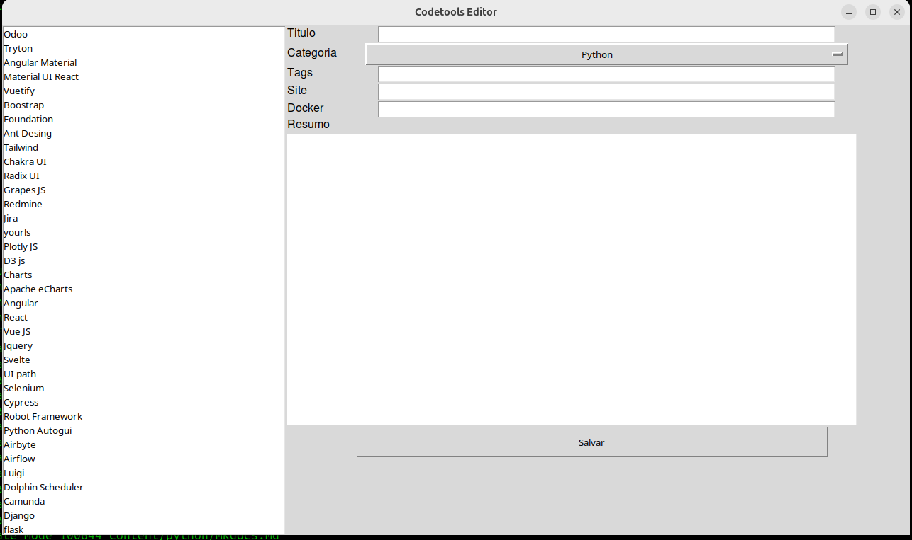
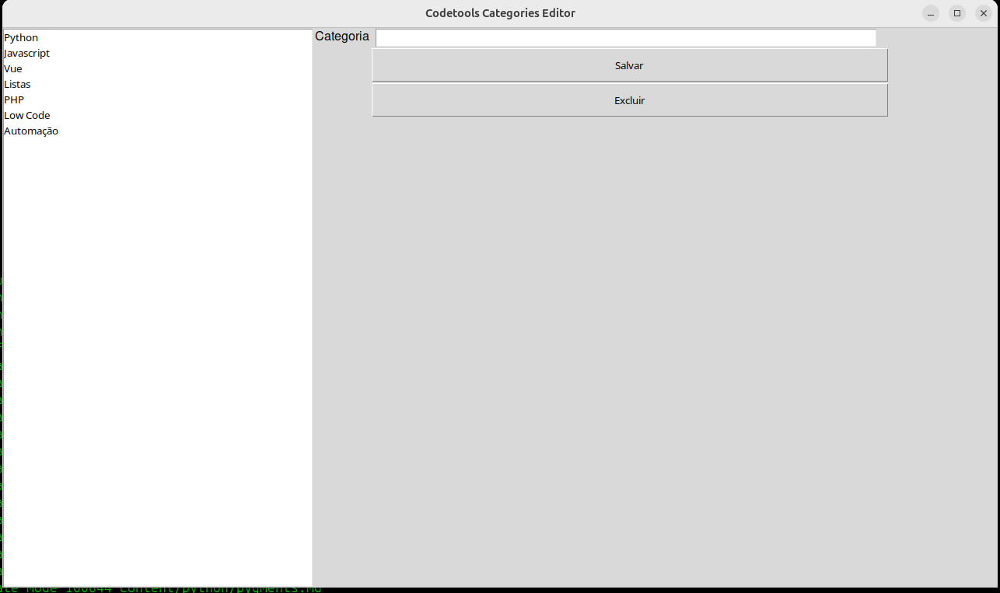

# Code Tools

Banco de dados de ferramentas para desenvolvedores

[Acesse](https://codetools.com.br/)


## Dependecias para rodar a ferramenta:
```
python3 -m venv .venv
source .venv/bin/activate
pip install -r requirements.txt
```

## Adicionado ferramentas:

Temos uma ferramenta gui para auxiliar quem deseja inserir novas ferramentas basta rodar:

```
python apps.py
```


## Novas categorias:

Caso precise adicionar novas categorias basta esse assistente

```
python categories.py
```



## Buildado as scripts e os aplicativos da base:

```
invoke build-data
```

## Buildado as imagens dos sites:

```
docker compose up -d
invoke build-images
```

## Para publicar:

```
invoke publish
```

### Abra um fork e pessa um Pull Request que eu publico! Muito obrigado